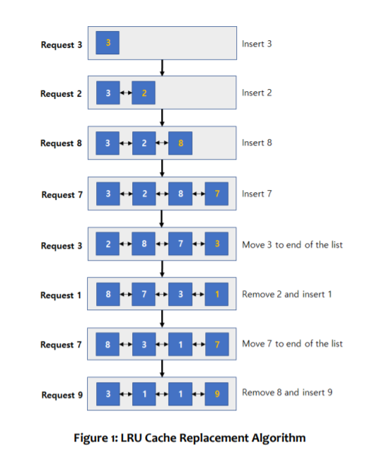
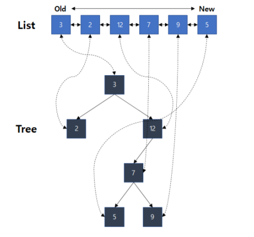

# Project Assignment 3: Binary Search Tree
In the last assignment, you implemented a linked list and two cache
replacement policies: FIFO and LIFO. In this assignment, you will implement a
binary search tree and two other cache replacement policies: LRU (Least
Recently Used) and RANDOM.

First, let's briefly summarize the BST (Binary Search Tree). BST is a tree, where
one node can have up to 2 child nodes. There is one rule in the way each node is
stored: based on the parent node's key, all the child nodes on the left have
smaller keys and all the child nodes on the right have larger keys. Using a tree
with these rules, we can find the key by simply comparing the key when
searching for a certain node. This imitates the behavior of doing a binary search
without having to fully sort all elements for every change in elements. Therefore,
finding an element in BST is usually much faster than doing the same with a list.

Next, let us look at the LRU policy. If the cache is full, the LRU policy replaces
the item that has not been referenced for the longest period. This is based on
reference characteristics, which is referred to as temporal locality, such that if
an item is referenced once, then that item will be more likely to be referenced
again soon. Therefore, the most important factor in this algorithm is the last
access time of each item.
Assume that the cache size is 4 and items are requested in the order as follows:
**A, B, C, D, A, E, C, B**. Then LRU operates as shown in Figure 1.

When the cache is empty, the required items are put in order. So, **A, B, C, D** are
filled in order. If the requested item already exists in the cache, its last access
time should be updated. If the requested item does not exist in the cache, the
item with oldest last access time is removed and a new one is inserted. (Note
that time, here, need not be absolute, but may be maintained in relative order.)
On the other hand, RANDOM literally chooses the random one in the cache
when one of them needs to be evicted.



## 1. Implementing BST (binary search tree) (30 pts)
First, you need to implement ```class BinarySearchTree``` in ```bst.h```. Here is
a description of the functions you need to implement. If you want, any private
helper function inside the class can be implemented.
\
In ```class BinarySearchTree:```
\
```BinarySearchTree()``` constructor
\
```~BinarySearchTree()``` destructor
\
```TreeNode<keyT, valT>* insert(keyT key, valT val)```
Insert a new node to tree and return pointer of it
\
```bool remove(T key)``` Remove a node from the tree
\
```TreeNode<T,P>* search(T key)``` search an element by key
\
```void clear(void)``` Remove all nodes in the tree
## 2. Implementing LRU policy with list and BST (30 pts)
You need to implement the ```class LRU``` in ```lru.h``` using the ```class BinarySearchTree``` you implemented above and ```class LinkedList```.



Technically speaking, LRU policy can be implemented only with a list. However,
it will take a long time to find an element for every reference in that case.
Therefore, you will implement the same data in two data structures to
implement the LRU. This is much more efficient because each data structure
performs well in a specific situation. So, BST will be used to find (and index)
the keys.
In the list, all elements in cache are in the order of their last access time. In
BST, they are ordered by their address value (the key). BST nodes will also
point to (index) the node in the list, so that it does not have to perform list
traversal for every access request. On the other hand, list is also beneficial as
updating the order is much faster in a list.

You must implement the following:
\
In ```class LRU:```
\
```LRU()``` constructor
\
```~LRU()``` destructor
\
```bool exists(int data)``` Return true if data exists in the cache or
false otherwise.
\
```int status(void)``` Return number of elements in cache.
\
```bool touch(int data)``` The data is being accessed. Return true
on hit, false on miss
\
```int get_misses()``` return the number of cache misses occurred
until now.
\
```class LinkedList``` will be provided. However, you may modify and use
your own implementation.
\
```LinkedList()``` constructor
\
```~LinkedList()``` destructor
\
```int size()``` return the number of elements
```bool empty()``` check whether the container is empty
\
```T& front()``` access the first element
\
```T& back()``` access the last element
\
```Node<T>* insert(Node<T>* node_before, type val)``` create a node with the element and insert it after node_before. **CHANGED:** It now returns the pointer to newly inserted node.
\
```void erase(Node<T>* target)``` erase an element
\
```Node<T>* push_front(T val)``` add an element at the front
\
```void pop_front()``` erase the first element
\
```Node<T>* push_back(T val)``` add an element at the back
\
```void pop_back()``` erase the last element
\
```Node<T>* find(T val)``` find an element of item val
\
```void print() const``` print the value of every element in the list
## 3. Implementing RANDOM policy with array (20 pts)
You need to implement the RANDOM cache replacement policy on ```class
Rand``` in ```rand.h```. You must use an array as its base data structure. Here is a
description of functions you need to implement.
In ```class Rand:```
\
```Rand()``` constructor
\
```~Rand()``` destructor
\
```bool exists(int data)``` Return true if data exists in the cache or
false otherwise.
\
```int status(void)``` Return number of elements in cache.
\
```bool touch(int data)``` The data is being accessed. Return true
on hit, false on miss
\
```int get_misses()``` return the number of cache misses occurred
until now.
## 4. Analysis of BST, LRU and RANDOM policies (20 pts)
You should perform performance evaluation of the cache replacement
algorithms (LRU, RANDOM) implemented so far. Please submit the report in
**pdf format** on Blackboard as before.
Your report must include at least the following:
* Basic description of your BST, LRU, and RANDOM implementation.
* Evaluate the implemented LRU and RANDOM policies using the given
test cases.
  * We will provide some example test cases. Compare the number of
misses for these tests with various number of items, cache size, etc.
  * Provide performance measurements for managing the cache when
using the two replacement policies. You must describe not only the
numbers but how you made the measurements.