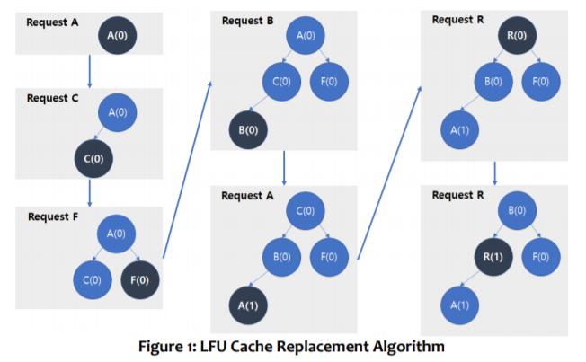

# Project Assignment 4: Heap
In the last assignment, you implemented a binary search tree and LRU (Least
Recently Used) cache replacement policy. In this assignment, you will
implement a heap and another cache replacement policy: LFU (Least
Frequently Used).

Typically, a heap is made an array or a tree. In this assignment, you will
implement a heap using an array. Also, as you already know, there are min
heap and max heap, and for LFU you need to implement min heap.

Let us look at the LFU policy. If the cache is full, the LFU policy replaces the
least frequently accessed item, which is an item that has the least number of
references after it was added to the cache. The policy is based on the heuristic
that items that have been heavily referenced in the past will be more likely
used again soon.

Assume that the cache size is 4 and items are requested in the order as
follows: **A, C, F, B, A, R, R**. Then LFU operates as shown in Figure 1 below.



If the requested item already exists in the cache, its number of references
should be updated. If the requested item does not exist in the cache, the
item with the least number of references is removed and the new one is
inserted. 
## 1. Implementing Min Heap (40 pts)
First, you need to implement ```struct MinHeap``` in ```minheap.h```. The
following is a list of the functions you need to implement. Note that this struct
is a set of methods on an external array instead of complete class with data
inside. You can add functions if you want to.
\
In struct MinHeap<T>:
\
```void make_heap(T* arr, int size, int hint)```
  * Arrange elements in arr to create a heap.
  * If hint is given, it is guaranteed that only the element of index
hint is altered after the last heap construction.
  * If hint is not given, all elements in arr can be in any order.
  * You will get a deduction if you do not use hint to optimize your
algorithm. 

```void pop(T* arr, int size)``` Remove the element with the
smallest value.
\
```void push(T* arr, int size, T item)``` Store a new item.
## 2. Implementing LFU policy with list and Min Heap (40 pts)
Next, you need to implement ```class LFU``` in ```lfu.h``` using the ```class
MinHeap``` you implemented. The following is a list of the functions you need
to implement. You can add private member variables and/or functions if you
want to.
\
In ```class LFU<T>:```
\
```LFU()``` constructor
\
```~LFU()``` destructor
\
```bool exists(T data)``` Return true if data exists in the cache,
return false otherwise.
\
```int status()``` Return number of elements in cache.
\
```bool touch(T data)``` The data is being accessed. First, check the
existence of data in the cache. If the data in the cache exists, increase
the reference value of the data, otherwise store the data in the cache.
Return true on hit, false on miss.
\
```int getMisses()``` Return the number of cache misses until now
## 3. Performance comparison for LRU and LFU (20 pts)
The notion of a “good” cache replacement policy can mean many things. One
measuring stick is the hit ratio, that is, how many times you find the element
you are looking for in the cache out of all your attempts. That is, it can thought
that a policy with higher hit ratio is a better performing cache replacement
policy. Another measuring stick is to actually measure the performance during
execution.

A good cache replacement policy may vary depending on the characteristics of
the data. For the given test cases, you should perform a performance
comparison for LRU and LFU.

Please submit the report in **pdf format** on Blackboard as before. Please fill out
the report with **no more than 3 pages**.

Your report must include at least the following:

* Measure and report the hit ratio for LRU and LFU for various 
conditions. For LRU, you should use the implementations from the
previous project.
* Measure and report the actual running performance of LRU and LFU
for various conditions. Make sure you describe how you made the
measurements, being specific about what parts were measured.
