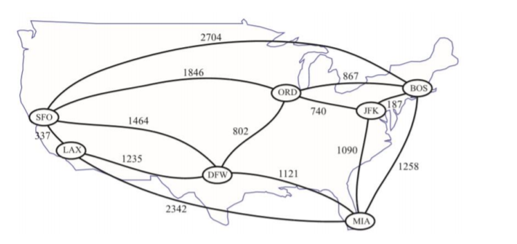

# Assignment 6: Directed Graphs and Dijkstra’s Algorithm
Many problems in computer science, especially Artificial Intelligence, involve
finding the shortest paths in a directed graph. How to correctly implement the
shortest path algorithms such as the famous Dijkstra’s algorithm is an essential
skill for computer science students. The performance of these algorithms
heavily depends on the choice of container classes for storing directed graphs.
In this exercise, you will learn how to implement the adjacency list structure
for directed graphs and Dijkstra’s algorithm for solving the single-source,
shortest path problems. At the end, you will write a program to help travelers
to solve their shortest path problems they encounter in real life.
### Our Goal: Finding the Shortest Routes in a Flight Map
Let’s take a look at the following map in Figure 13.13 of the textbook:



This figure shows a map of the flight connections in the major airports in the
United States. As you can see, there are some airports that do not have direct
flights between them (e.g., BOS and LAX). A passenger would have to choose
a route with multiple connecting flights to get to his/her destination if there is
no direct flight. The question for the passenger is: what is the shortest route to 
reach the destination? The problem faced by the passenger is the single-source, shortest paths problem, a classic problem in graph theory. In this
exercise, you will write a program to help the passenger to solve this problem.
Your program will load the data of flight connections from a file and run the
Dijkstra’s algorithm to find the shortest route between two airports.
## 1. Implementing Adjacency Lists of Directed Graphs (50 pts)
While the example in Figure 13.13 assumes the graph of flight connections is
undirected, a more realistic assumption is that the flight map is a directed
graph in which the flight distance of the two directions between two airports
can be different. While there are many ways to implement an adjacency list
structure for directed graphs, we want you to implement the one as described
in Section 13 in the textbook, as its operations can achieve the running times in
Table 13.2 of the textbook. To achieve the O(1) running time of eraseEdge()
and O(deg(v)) of eraseVertex(), it is necessary to maintain the positions (i.e.,
iterators) of the collections of vertices and edges in the graph. Other simple
implementations of adjacency list structures without maintaining these
positions may not guarantee the time complexity of the above operations.

In this part of the project, you will implement the adjacency list structure as
described in Sections 13.1.1, 13.2.2, and 13.4 of our textbook to store flight
maps. Your implementation should faithfully follow the description in the
textbook. On page 599, the textbook has provided all the details the interface
of a Graph ADT, which includes the following member functions:

```Vertex::operator*()```, ```Vertex::incidentEdges()```, ```Vertex::isAdjacentTo()```,
```Edge::operator*()```, ```Edge::endVertices()```, ```Edge::opposite()```,
```Edge::isAdjacentTo()```, ```Edge::isIncidentOn()```, ```vertices()```, ```edges()```, ```insertVertex()```,
```eraseVertex()```, and ```eraseEdge()```. Since we will implement a directed graph, the
Graph ADT should also include the following member functions as described
on page 626: ```Edge::isDirected()```, ```Edge::origin()```, ```Edge::dest()```, and
```insertDirectedEdge()```. Notice that we will omit ```insertEdge()``` as it is replaced by
```insertDirectedEdge()``` as discussed in Section 13.4. 

In addition, you need to implement five more member functions for directed
graphs:
* ```Vertex::isOutgoingTo(v)``` constructor. This function returns true if and
only if there is a directed edge connecting the current vertex to the 
given vertex v.
* ```Vertex::outgoingEdge(v)``` This function returns the directed edge
connecting the current vertex to the given vertex v. If there is no such
edge, it throws an exception.
* ```Vertex::outgoingEdges()``` This function returns the set of all directed
edges connecting the current vertex to any vertex in the graph.
* ```Vertex::operator==(v)``` This function returns true if and only if the
current vertex is the same as the given vertex v.
* ```Edge::operator==(e)``` This function returns true if and only if the
current edge is the same as the given edge v. 

We provide you a skeleton of the ```AdjacencyListDirectedGraph``` class in
```AdjacencyListDirectedGraph.h```, which contains the headers of all of the above
member functions. All you need is do is to implement these member functions
according to the adjacency list structure in the textbook.
An overview of the adjacency list structures is shown in Figure 13.4 on page
603 in Section 13.2.2. Your implementation should exactly implement the
structure in this figure. Notice that this adjacency list structure is built on top
of the edge list structure in Section 13.2.1, which means that you will have to
understand the edge list structure as well. To facilitate a correct understanding
of the implementation, we have already defined the classes for vertex objects
and edge objects in ```AdjacencyListDirectedGraph.h``` for you. You just need to
take a look at the classes to see how they correspond to the description in the
textbook. The classes have included all the member variables as described in
Section 13.2.
In the code we provide in ```AdjacencyListDirectedGraph.h```, all vertex objects,
edge objects, and incidence collections are stored in these member variables:
vertex_collection, edge_collection, and inc_edges_collection, which are list
objects in STL. These are all the member variables you need, and you should
not declare any other member variables, even a private one, in the
AdjacencyListDirectedGraph class. Notice that these variables are defined as
list objects because other container classes such as vectors in STL may not
guarantee that their iterators remain valid after you modify the containers. In
fact, the list container class in STL is one of the few that does guarantee that
its iterator will continue to point to the same objects after you modify the
container.

In this part of the project, you need to implement the member functions in
```AdjacencyListDirectedGraph```. You should not modify any code that are given in 
```AdjacencyListDirectedGraph.h```, and you should not add any other member
variables and member functions. To simplify the implementation, you are
allowed to assume that vertices and edges passed as arguments to the
member functions are never “NULL” (i.e., they always refer to a vertex object
or an edge object). This assumption can save you some codes for error
handling. There is also no need to define the constructor and the destructor as
the list member variables will automatically free their own memory. 

## 2. Implementing Dijkstra’s Algorithm (50 pts)
We also provide you ```FlightMap.h```, in which we define the ```FlightMap``` class that
is used in ```main.cpp```. The ```FlightMap``` class contains all the functionalities that are
needed in our application—there is no need to extend it to add more public
member functions. However, you are allowed to add some private member
functions to FlightMap.h if you want.

For each member function of the FlightMap class, we have written a detailed
description of its inputs, its outputs, and its function in the comments in
FlightMap.h. Please take a look at the comments to learn what these member
functions are. We have also implemented most of the member functions in
FlightMap.cpp. We strongly recommend you to read the codes in
FlightMap.cpp to learn about how to use the AdjacencyListDirectedGraph
class.
There are three member functions of the FlightMap class that are not
implemented in FlightMap.cpp:
* ```FlightMap::calcRouteDistance(route)``` Calculate the total distance of a
route.
* ```FlightMap::findShortestRoute(airport1, airport2)```  Find the shortest
route between two airports.
* ```FlightMap::printAllShortestRoutes(airport)``` Print all shortest routes to
all airports reachable from a given airport.

Please notice that you must implement these member functions in
```assignment6.cpp``` (not in ```FlightMap.cpp```). The comments in ```FlightMap.h```
provide the detailed description of the inputs, the outputs, and the functions
of these member functions. You should also take a look at the outputs of the
sample program called flight-map-sample to see exactly how they work. 
In ```FlightMap::findShortestRoute()``` and ```FlightMap::printAllShortestRoutes()```,
you will implement a shortest path algorithm to find the shortest routes. In
this part of the project, we ask you to implement Dijkstra’s algorithm for
finding the single source, shortest-paths in a directed graph. Section 13.5.2 in
the textbook is dedicated to the discussion of the algorithm. More specifically,
the Code Fragment 13.24 is the pseudo-code of Dijkstra’s algorithm. Please
read the pseudo-code to learn how the algorithm works. While the discussion
in Section 13.5.2 is for undirected graphs, the same algorithm will work for
directed graph with very little modification.

In fact, there are many different ways to implement Dijkstra’s algorithm, and
you are free to explore other options. Most implementations use a priority
queue to store the current frontier (i.e., the set of vertices that will soon be
expanded) in Dijkstra’s algorithm. Instead of implementing your own priority
queue, we allow you to use ```priority_queue``` in ```STL``` to implement the algorithm.
However, there is one drawback of using ```priority_queue``` in ```STL```: Dijkstra’s
algorithm requires the modification of keys in the priority queue in the
relaxation step, but ```priority_queue``` in ```STL``` does not support the modification of
a key of an element in a priority queue, and you cannot remove any non-top
element from the priority queue. Fortunately, there is an implementation of
Dijkstra's algorithm that does not require modifying the keys of non-top
elements. The idea is that a vertex can be inserted into a ```priority queue```
**multiple** times whenever its cost is getting lower, without removing any of
them from the priority queue. The algorithm also maintains the set of vertices
that have been **visited** (i.e., their shortest paths have been found). When
popping from the priority queue, the algorithm ignores the vertices that have
been visited. The effect will be the same as modifying the keys of non-top
elements in the ```priority queue```.

There is a high chance that you will use ```list```, ```vector```, and ```priority_queue``` in ```STL```
to implement your algorithm. We expect you to learn how to use these ```STL```
classes yourself by reading some online materials. Notice that the C++ compiler
we will use on evaluations is C++11 standard of our uni-server. Hence, you
should use the features of C++11 of these ```STL``` classes only.

You are allowed to include some private member functions to help you
implement the above member functions. You will have to declare them in
```FlightMap.h```, and submit the file along with ```assignment6.cpp```. However, we
insist that you should not modify the existing codes in ```FlightMap.h```. You should 
not add any member variables and public member functions in ```FlightMap.h```.
Please take a look at ```FlightMap.h``` and locate the line: **“You should not modify
anything above this line in this class.”**
## Testing
All files that you need in this project are the following files:
* ```FAQ.txt``` — the answers to some frequently asked questions before.
* ```flight-map-sample``` — the sample program. The option j and k in the
sample program is out of the scope and thus will not be tested.
* ```main.cpp``` — the main function of your program.
* ```AdjacencyListDirectedGraph.h``` — your implementation of adjacency list
structure for directed graphs. You will submit this file.
* ```FlightMap.h``` — the ```FlightMap``` class. You will submit this file.
* ```FlightMap.cpp``` — the definition of some member functions in
```FlightMap.h```.
* ```assignment6.cpp``` — your implementation of the member functions in
FlightMap.h that have not been implemented in ```FlightMap.cpp```. You
will submit this file.
* ```graph1.txt``` — the data of the graph in Figure 13.15 of the textbook.

We provide you a sample program called ```flight-map-sample``` that implements
all functionalities of this program. We also provide you a graph data file called
```graph1.txt```, which contains the data of the graph in Figure 13.15 of the
textbook. Please run the sample program with the graph data file on our
submission server to see the output it generates. Please make sure that the
output of your
program is the same as the output of the sample program (except the white
spaces and the error messages in the exceptions).

You can check the correctness of Dijkstra’s algorithm in your program by
comparing your solution with the one in Figure 13.15. Apart from ```graph1.txt```,
we recommend you to write a few more graph data files of your own to test
your program. 

In this exercise, you are allowed to use these container classes in the ```Standard
Template Library```: ```list```, ```vector```, ```queue```, ```map```, ```set```, and ```pair```. However, you should
not use other data structures in ```STL``` except the iterators of these container
classes and some common exceptions such as ```runtime_error```. If in doubt,
please contact the TAs to ask whether a data structure in ```STL``` can be used.
We will test your implementation of ```AdjacencyListDirectedGraph``` using a
different main function that is different from the one in ```main.cpp```. 

We will test
the completeness and correctness of your implementation, including whether
your code will throw all necessary exceptions. We will also check whether your
program will cause memory leak. We will also test whether ```assignment6.cpp```
uses the member functions in ```AdjacencyListDirectedGraph``` correctly by
replacing ```AdjacencyListDirectedGraph.h``` with the instructor’s implementation
of ```AdjacencyListDirectedGraph.h```.

The error messages in runtime_error exceptions do not have to be exactly the
same as the messages in the sample program we provided. You can write the
error messages in your own sentences. However, we will check whether your
algorithm throws the exceptions when necessary.
Try this for your compilation:

```$ g++ -o output assignment6.cpp FlightMap.cpp main.cpp -std=c++11```

Those compile options are what we are going to use for the actual evaluation.